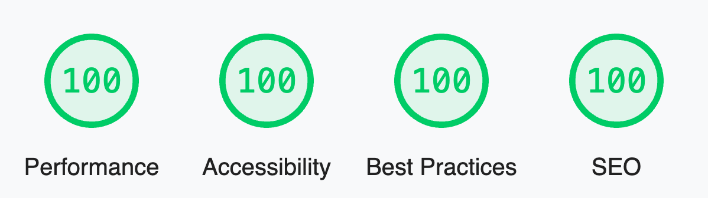

# Odyssey Theme

Odyssey Theme is a modern theme/starter for a business or startup's marketing website. It provides landing page examples, a full-featured blog, contact forms, and more. It is fully themeable to match your business' branding and style. It even includes a theme switcher component to show how easily the entire style of the site can be changed with only a few lines of CSS.

## Features

<p align="center">
  
</p>


- ✅ **A perfect score in Lighthouse**
- ✅ **Blazing fast performance thanks to Astro 🚀**
- ✅ **A Full Featured Blog with Tagging**
- ✅ **Fully theme-able styles with for buttons, shapes, backgrounds, surfaces, etc.**
- ✅ **Responsive, mobile-friendly landing pages**
- ✅ **SEO Best Practices (Open Graph, Canonical URLs, sitemap)**
- ✅ **Performant Local Fonts Setup**
- ✅ **Contact Forms Setup for Netlify, Formspree, Formspark, etc.**
- ✅ **A package of ready-to-use UI components**


## Usage

```bash
cd theme

npm install

npm start
```

## Deploy

Feel free to deploy and host your site on your favorite static hosting service such as Netlify, Firebase Hosting, Vercel, GitHub Pages, etc.

Astro has [an in-depth guide](https://docs.astro.build/en/guides/deploy/) on how to deploy an Astro project to each service.


## Support

Please feel free to reach out to us on our Discord if you have questions or file an issue on the repo.


